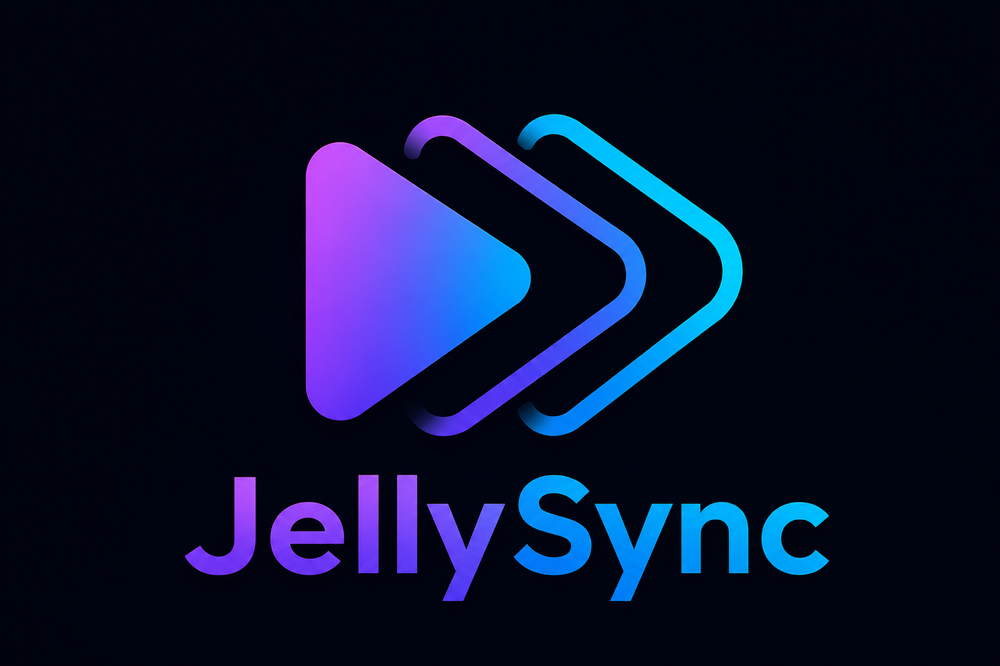

# JellySync



JellySync is a Jellyfin 10.11.11 plugin that synchronizes movie and episode watch state between selected users.

It synchronizes only:

- Played state
- Play count
- Last-played date
- Playback position

Favorites, ratings, preferred audio/subtitle streams, and other private user data are preserved.

## Installation

1. In Jellyfin, open **Dashboard → Plugins → Repositories**.
2. Add a repository named `JellySync` with this URL:

   ```text
   https://raw.githubusercontent.com/ryanonmars/jellysync/main/manifest.json
   ```

3. Open the plugin catalog, find JellySync, and install it.
4. Restart Jellyfin when prompted.
5. Open **Dashboard → Plugins → JellySync** to configure it.

## Testing safely

Start with two disposable users and a small test library.

Incremental synchronization is bidirectional between configured users. **Full Sync Now is destructive:** the selected source user's watch state overwrites every other selected user's watch state in the configured libraries. If the source has no history for an item, watched state on the targets is cleared.

## Compatibility

The initial beta targets Jellyfin `10.11.11`.

## Development

Create a release build with:

```sh
dotnet build Jellyfin.Plugin.JellySync/Jellyfin.Plugin.JellySync.csproj --configuration Release
```

## License

JellySync is licensed under the GNU General Public License v3.0. See [LICENSE](LICENSE).
